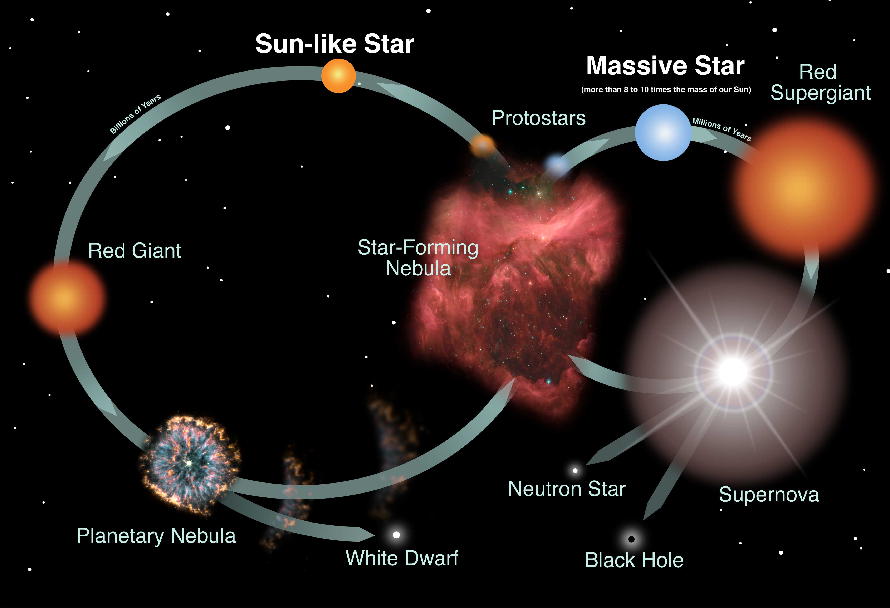
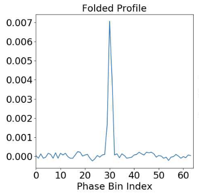
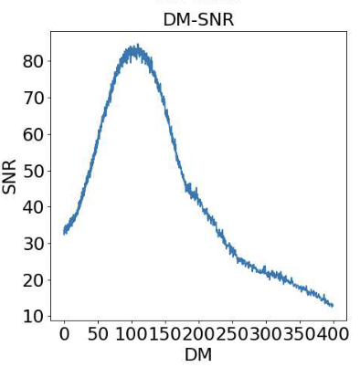
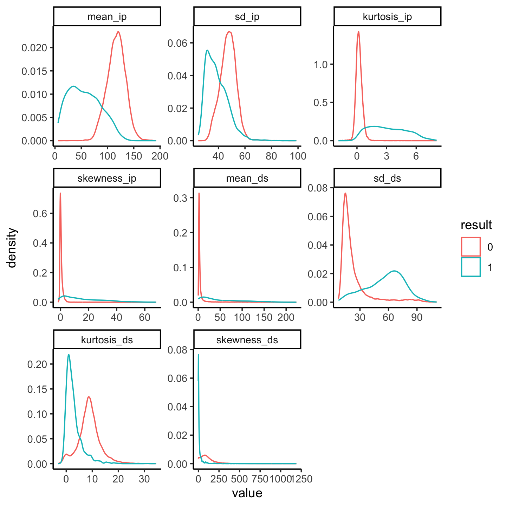
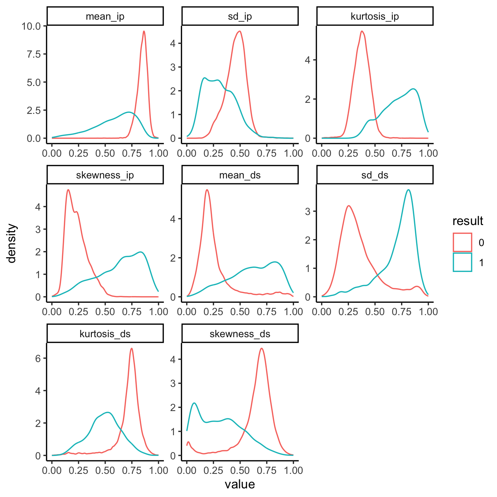
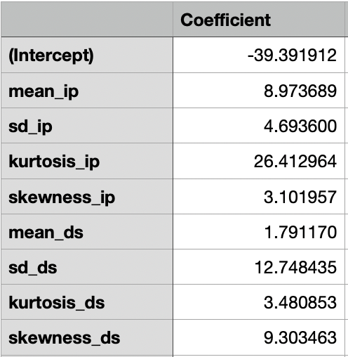
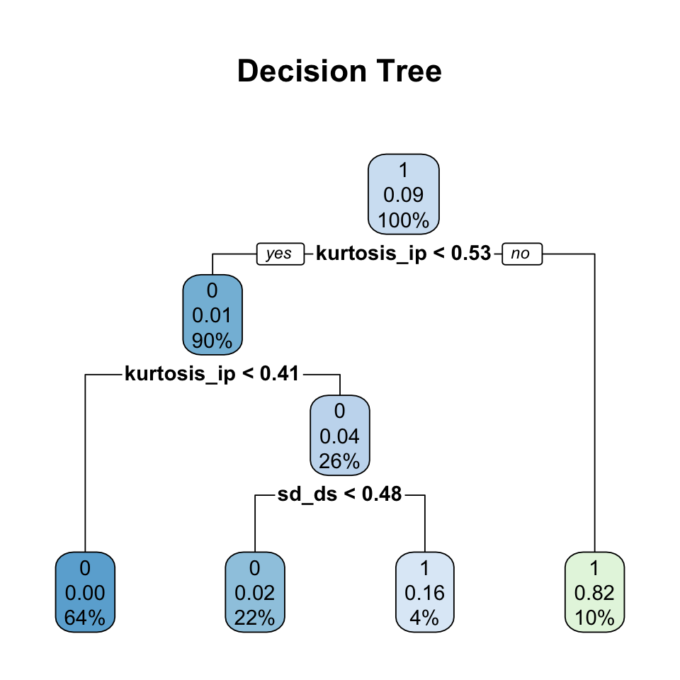
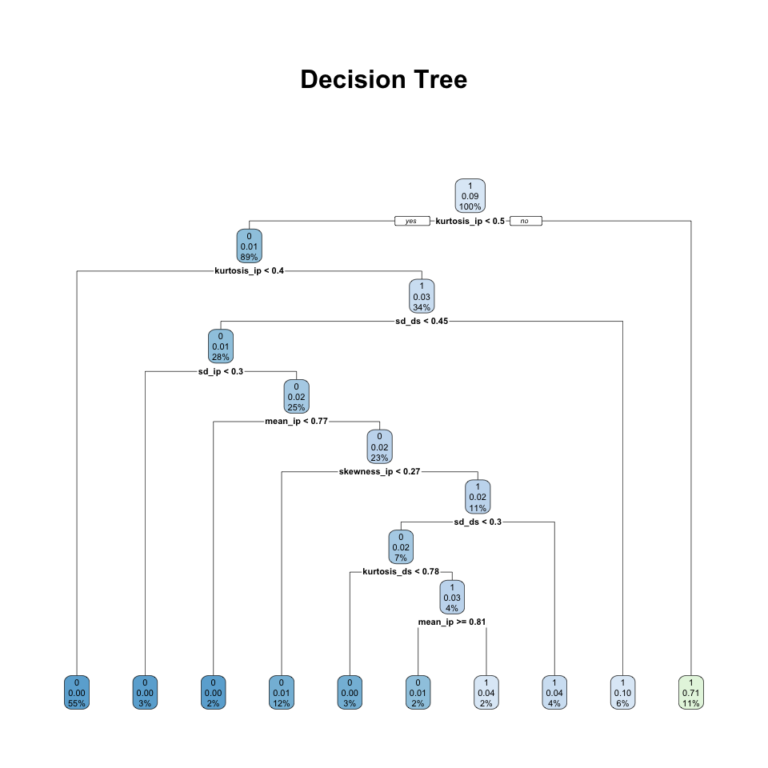
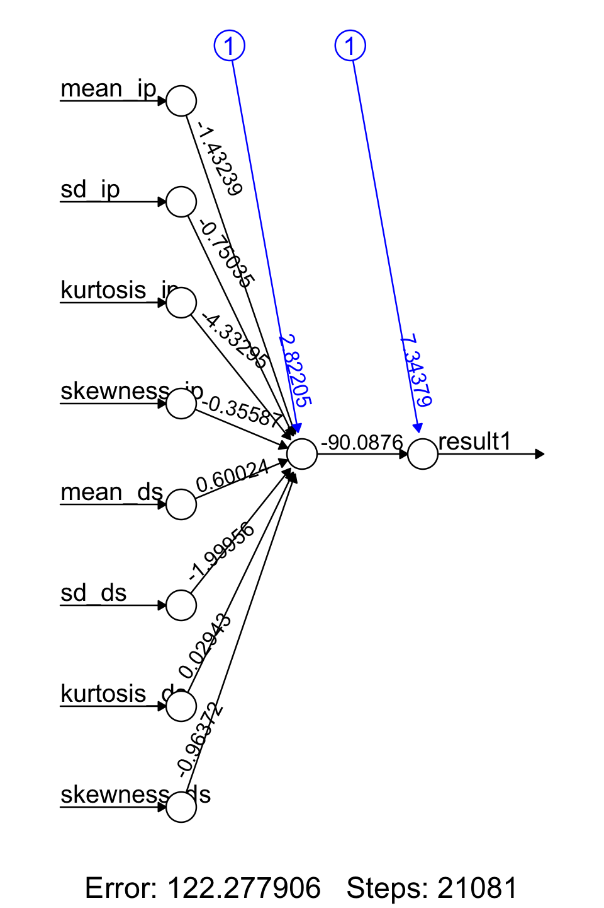
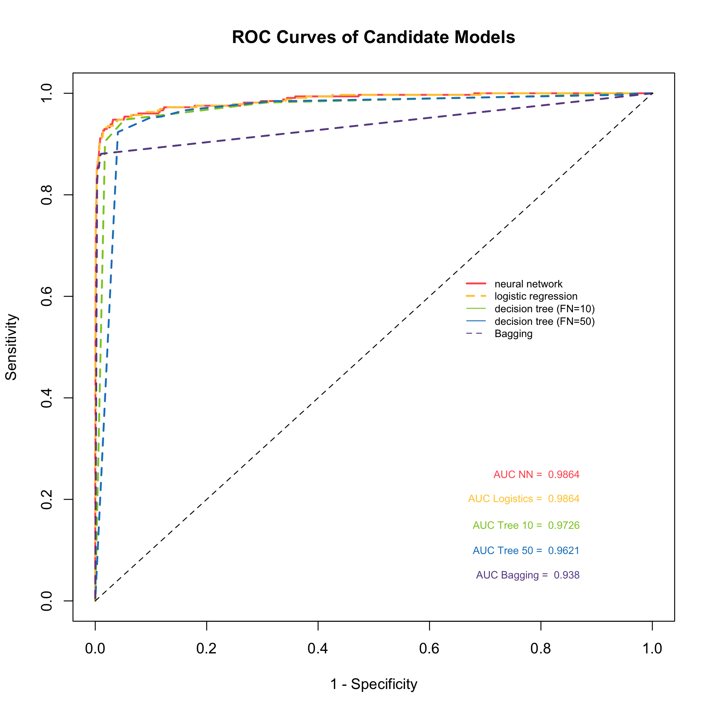

```{r setup, include=FALSE}
knitr::opts_chunk$set(echo = FALSE)
```

## Introduction

```{r fig.align='center', out.width = "600px", fig.cap="Life Cycle of a Star"}

```

## Integrated Pulse Profile

- Pulsars emit very weak signals 
- Emissions are highly variable from pulse to pulse
- Average multiple single pulses into an **integrated pulse profile**
    + More consistent across observations  
    + Stable in time
    
```{r fig.align='center', out.width = "300px", fig.cap="Life Cycle of a Star"}

```


## DM-SNR Curve
- Dispersion measure (DM)
    + measures the spread of the pulse.
- Signal-to-noise ratio (SNR)
    + measures the strength of a pulsar's signal relative to background noise 
- Plot DM on x-axis and SNR on y - axis

```{r fig.align='center', out.width = "300px", fig.cap="Life Cycle of a Star"}

```

## Description of Data

- 17898 observations
    + 16,259 observations caused by noise
    + 1,639 real pulsar observations
- 8 features
    + `mean_ip` : Mean of the integrated profile 
    + `sd_ip` : Standard deviation of the integrated profile 
    + `kurtosis_ip` : Excess kurtosis of the integrated profile 
    + `skewness_ip` : Skewness of the integrated profile 
    + `mean_ds` : Mean of the DM-SNR curve 
    + `sd_ds` : Standard deviation of the DM-SNR curve 
    + `kurtosis_ds` : Excess kurtosis of the DM-SNR curve 
    + `skewness_ds` : Skewness of the DM-SNR curve
	  
## Practical Questions to Address
- What is the distribution of our features?
    + Does it need to be transformed?
- Can we find a model to accurately differentiate a pulsar observation from noise?
- Can we find a model to minimize false negatives?

## Feature Distribtuions
```{r fig.align='center', out.width = "600px", fig.cap="Feature Distributions"}

```

## Transformation of Features

- Scaling 
$$ x = \frac{x - \min(x)}{\max(x)-\min(x)}$$
- Negative log transformation 
$$T(x) = \text{sign}(x) \cdot \log(|x| + 1)$$

## Transformed Feature Distributions 

```{r fig.align='center', out.width = "600px", fig.cap="Transformed Feature Distributions"}

```

## Candidate Models and Justifications
- All features are important!
- 3 Models
    + Logistic regression
    + Perceptron
    + Decision trees
- Minimize false negatives 


## Logistic Regression

```{r fig.align='center', out.width = "400px", fig.cap="Logistic regression coefficients"}

```

## Decision Trees

```{r fig.align='center', out.width = "600px", fig.cap="Decision tree with 10x penalty for false negatives"}

```

## Decision Trees 

```{r fig.align='center', out.width = "600px", fig.cap="Decision tree with 50x penalty for false negatives"}

```

## Perceptron

```{r fig.align='center', out.width = "400px", fig.cap="Perceptron weights"}

```


## Model Selection

```{r fig.align='center', out.width = "600px", fig.cap="ROC curve"}
knitr::include_graphics("roc-curve.png")
```

## Results

```{r fig.align='center', out.width = "600px", fig.cap="ROC curves of candidate models"}

```

## Conclusions
- Neural network and logistic model work best
- Decision tree models effected by penalty choices
- AUC not best choice of metric

## Limitations
- Constrained by model choices
- Models, too simple
    + More complicated decision tree models were applied in paper
    + Neural Network limited to percetron model
- Choosing better measures than AUC 
